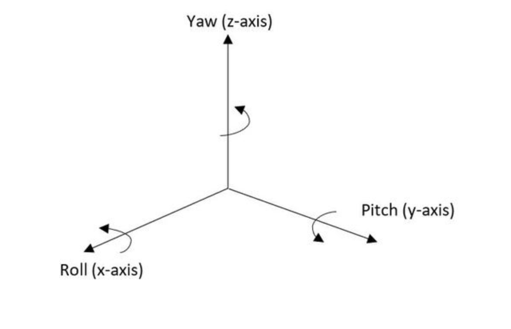
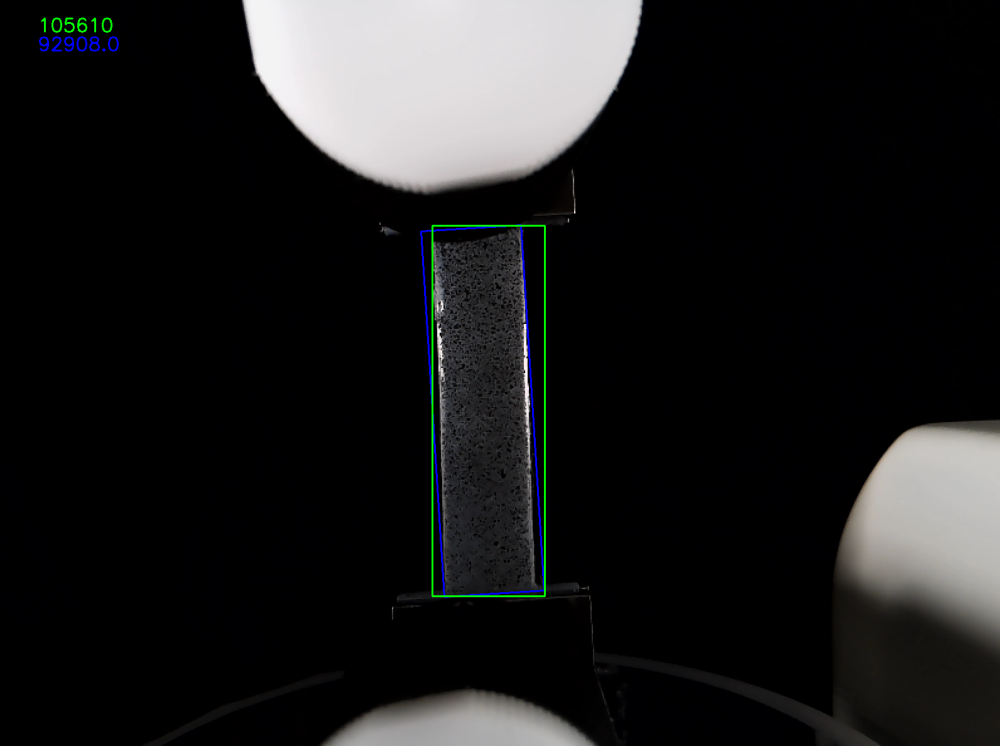
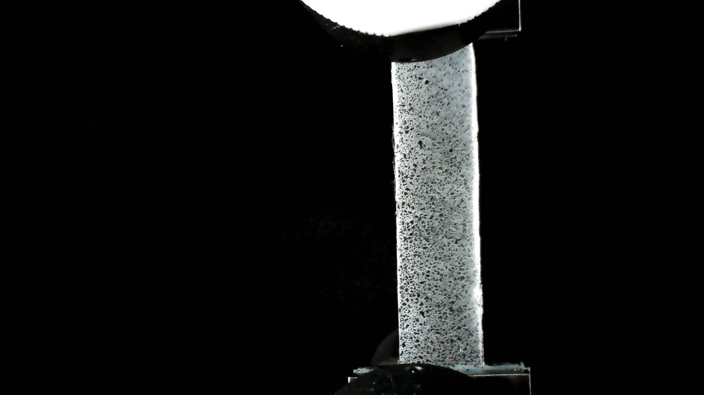
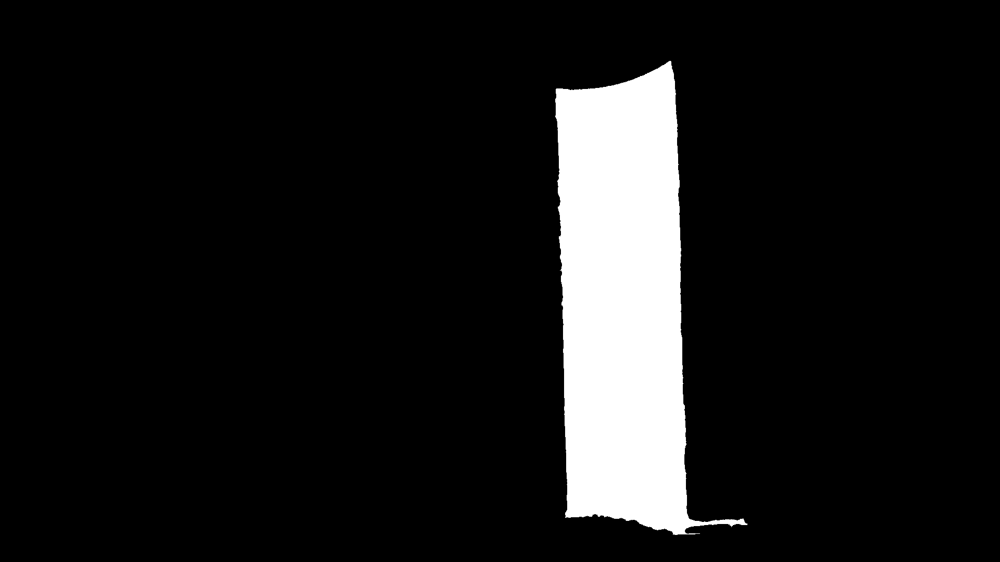
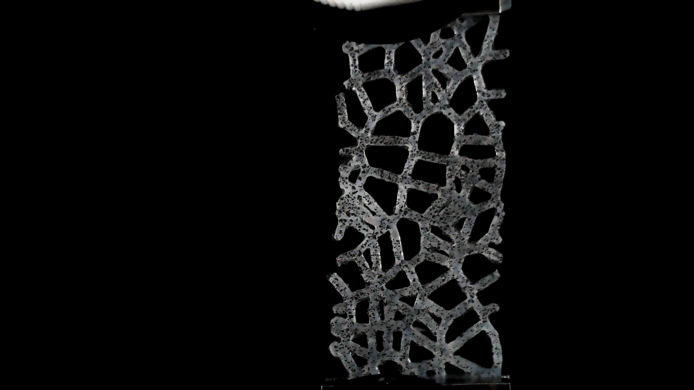
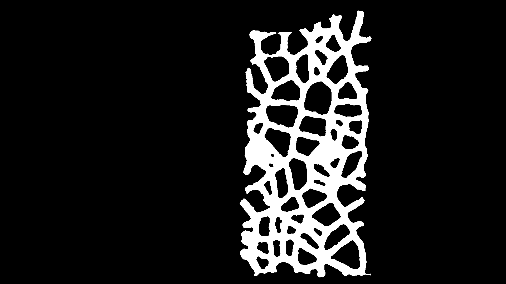

# DIC Pipeline

This repository contains code that is able to control an Arducam camera with the Raspberry Pi as well as GPIO output signals to start the Instron and camera at the same time. The Raspberry Pi can be thought of as its own small computer with a Linux based OS. One of the methods to access the Raspberry Pi itself after setup is through ssh. Note that the code in the raspberry pi can be committed to this repository.

### More information on DIC can be found here:
1. [Good Practices Guide For DIC](https://idics.org/guide/)
2. [NCORR - Open Source 2D DIC Software](http://www.ncorr.com/)
3. [DuoDIC: 3D Digital Image Correlation in MATLAB](https://joss.theoj.org/papers/10.21105/joss.04279)
4. [Evaluating Spekle Quality using Glare](https://www.sciencedirect.com/science/article/pii/S0143816621002360)

## Table of Contents
- [DIC Pipeline](#dic-pipeline)
    - [More information on DIC can be found here:](#more-information-on-dic-can-be-found-here)
  - [Table of Contents](#table-of-contents)
  - [Contents in This Repository](#contents-in-this-repository)
  - [Dependencies](#dependencies)
  - [Project Summary](#project-summary)
    - [Checkerboard Calibration](#checkerboard-calibration)
    - [Minimum Area Rectangle](#minimum-area-rectangle)
    - [Masking](#masking)
  - [V4L2](#v4l2)

## Contents in This Repository

| Folder| Contents of the folder|
|-------|--------|
|[camera_only_script](camera_only_script)| scripts in this folder only run manipulate the camera and contains folder for calibration images|
|[DIC_imgs](DIC_imgs)| Output images and mask after running DIC |
|[gpio_only_script](gpio_only_script)| Scripts in this folder only sends GPIO outputs |
|[utils](utils) | All the functions that are used in this repo | 
|[run_DIC](run_DIC.py) | Script that manipulates camera and sends GPIO output for DIC |

## Dependencies 
The code in this repository is written using Python and relies on the OpenCV and Numpy libraries. 

## Project Summary

This pipeline is designed to calibrate the camera before DIC and take images durning the deformation of the specimen. It will also create a mask of the initial image which can then be used in a software like Ncorr to run DIC.

### Checkerboard Calibration

Running the file will start by allowing you to align the camera to the subject by placing a checkerboard pattern in the Instron. The number of rows and columns in the checkerboard should be specified when calling the function (the default is 8x6 but any number will work).

The function displays the video and also prints out the rotation vector labeled as roll, pitch, and yaw. Rotation around the front-to-back axis is called roll. Rotation around the side-to-side axis is called pitch. Rotation around the vertical axis is called yaw. See the diagram below for further clarification.

**In order to get accurate results, you need to have calibration images of the checkerboard taken using the same camera. These images should be stored on the pi so that they can be used to obtain distortion coefficients and the camera matrix.**

Ideally, the angles for row, pitch, and yaw should be zero or as close to zero as possible in order to reduce out of plane motion during DIC. Once the camera is aligned, it should be locked in place in order to prevent any more movement.

### Minimum Area Rectangle

After aligned the camera, replace the checkerboard with the actual DIC subject in the instron. In order to ensure that the subject is perfectly vertical, the script will find the orientation of the subject and print out the angle.

### Masking

The initial image captured by the camera before the instrong begins stretching the subject will be automatically masked and saved to the pi. Images will be taken over the period of 10 seconds which can be modified within the code and also saved to the pi.

It is best to use a black background and to ensure that there are no other objects in the final image other than the DIC specimen itself and the instron to ensure the highest quality mask.

## V4L2

The code uses v4l2 to control the camera. List of useful controls can be foud [here](https://manpages.ubuntu.com/manpages/bionic/man1/v4l2-ctl.1.html):
https://manpages.ubuntu.com/manpages/bionic/man1/v4l2-ctl.1.html

